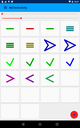

# MyTestApp

A test app for [My Blocks](https://github.com/langara/MyBlocks) library.

It is a fork of MyBlocks library configured to run a test activity (MyTestActivity).

It allows to test features like:

* Global and local navigation
* Default FAB
* MyLogger
* MyUtils
* MyCommands
* Living drawables
* Custom views like MyPie
* Animations, fragment transitions etc..
* And more..

* TODO: link to Google Play
* TODO: link to record screen video

#### Screenshots

###### Nexus 4 portrait

###### Nexus 4 landscape

###### Nexus 7 portrait

###### Nexus 7 landscape

###### MyTab 10 Q landscape

